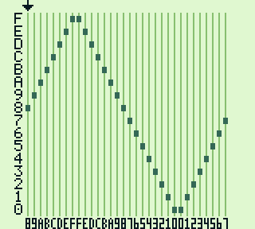
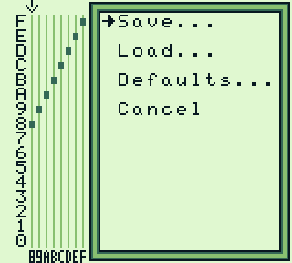
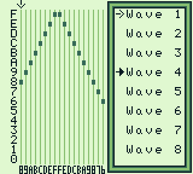
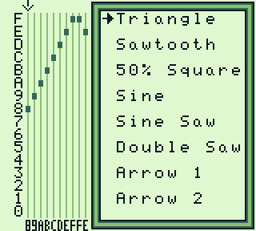
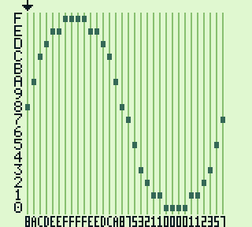
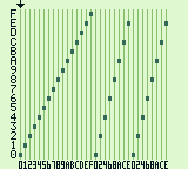

# waveform.gb

This program visualizes the wave form used by the wave channel.  
The wave form can be edited freely and playback of the wave is updated immediately.

Up to 8 custom wave forms can be saved.  
There are 8 built-in wave forms that can be loaded at any time.

## Screenshots
   
   
 

## Building

To build, install [rgbds][rgbds] and put it in your path.  
Then run `make`. This will create `waveform.gb`.

This project is based off of [bootstrap.gb][bootstrap.gb] by [yenatch][yenatch].

[rgbds]: https://github.com/rednex/rgbds
[bootstrap.gb]: https://github.com/yenatch/bootstrap.gb
[yenatch]: https://github.com/yenatch
